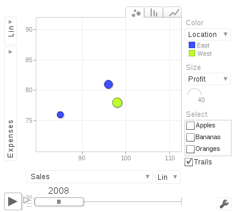

# The `googleVis` package

The package provides an interface to Google's chart tools, allowing users to create interactive charts based on data frames. It included maps.

The interactive maps are displayed in a browser. We can plot a complete set of interactive graphs and embed them into a web page.

Some motion charts cannot be displays in tablets and mobile phones (using HTML5) because they are rendered with Flash; Flash has to be installed on a PC.

- [Examples](https://cran.r-project.org/web/packages/googleVis/vignettes/googleVis_examples.html).
	- Charts: line, bar, column, area, stepped area, combo, scatter, bubble, customizing, candlestick (or boxplot), pie, gauge, annotation, Sankey, histogram, and motion (GapMinder-like)
	- Maps: intensity, geo, choropleth, marker, Google Maps.
	- Table, organizational chart, tree map, calendar, timeline, merging.
	- Motion charts and some maps only work in Flash, not in HTML5 as with tablets and mobile phones).
- [Gallery](https://developers.google.com/chart/interactive/docs/gallery).
- [Documentation](https://developers.google.com/chart/).
	- As above.
- [Introduction](https://cran.r-project.org/web/packages/googleVis/vignettes/googleVis.pdf).
- [Roles](https://cran.r-project.org/web/packages/googleVis/vignettes/Using_Roles_via_googleVis.html).
- [Trendlines](https://cran.r-project.org/web/packages/googleVis/vignettes/Using_Trendlines_with_googleVis.html).
- [Markdown](https://cran.r-project.org/web/packages/googleVis/vignettes/Using_googleVis_with_knitr.html).
- In R, run a demo with `demo(googleVis)`.

Always cite the package:

```{r}
citation("googleVis")
```

Here is an example (converted in png) of the `gvisMotionChart`.

```{r, eval=FALSE}
suppressPackageStartupMessages(library(googleVis))

M <- gvisMotionChart(Fruits,
                     idvar='Fruit',
                     timevar='Year',
                     options=list(width=400, height=350))

plot(M)
```

The results as an image:


<br>

The problem with `googleVis` motion chart is they only work with Flash players; PC browsers with Flash can render motion charts. Tablets and mobiles phones only render HTML5. 

The next charts and maps are made of HTML, CSS, JavaScript.

```{r, eval=FALSE}
Geo <- gvisGeoChart(Exports, 
                    locationvar="Country",
                    colorvar="Profit",
                    sizevar="", # size of markers
                    hovervar="", # text
                    options=list(projection="kavrayskiy-vii"))

plot(Geo)
```

<embed seamless src="img/Geo.html" width=600px height=400px ></embed>

We can even edit the results in the browser!

```{r, eval=FALSE}
Editor <- gvisGeoChart(Exports, 
                       locationvar="Country",
                       colorvar="Profit",
                       options=list(gvis.editor='Edit me!'))

Plot(Editor)
```

<embed seamless src="img/Editor.html" width=700px height=500px ></embed>

```{r, eval=FALSE}
Geo2 <- gvisGeoChart(CityPopularity, 
                     locationvar='City',
                     colorvar='Popularity',
                     options=list(region='US',
                                  height=350,
                                  displayMode='markers', 
                                  colorAxis="{values:[200,400,600,800], colors:[\'red', \'pink\', \'orange',\'green']}"))

Plot(Geo2)
```

<embed seamless src="img/Geo2.html" width=600px height=400px ></embed>

```{r, eval=FALSE}
CityPopularity3 <- data.frame(City = c('Montreal', 'Toronto'),
                              Popularity = c(700, 200))

Geo3 <- gvisGeoChart(CityPopularity3, 
                     locationvar='City',
                     colorvar='Popularity',
                     options=list(region = 'CA',
                                  height=350,
                                  displayMode='markers', 
                                  colorAxis="{values:[200,400,600,800], colors:[\'red', \'pink\', \'orange',\'green']}"))

Plot(Geo3)
```

<embed seamless src="img/Geo3.html" width=600px height=400px ></embed>

```{r, eval=FALSE}
PopTable <- gvisTable(Population, 
                      formats=list(Population="#,###",
                                   '% of World Population'='#.#%'),
                      options=list(page='enable'))

Plot(PopTable)
```

<embed seamless src="img/PopTable.html" width=600px height=600px ></embed>

```{r, eval=FALSE}
G <- gvisGeoChart(Exports,
                  locationvar="Country",
                  colorvar="Profit",
                  options=list(width=300, height=200))

T <- gvisTable(Exports,
               options=list(width=300, height=370))

GT <- gvisMerge(G, T, horizontal=FALSE)

Plot(GT)
```

<embed seamless src="img/GT.html" width=600px height=600px ></embed>

---
