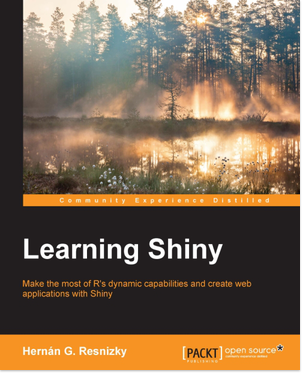
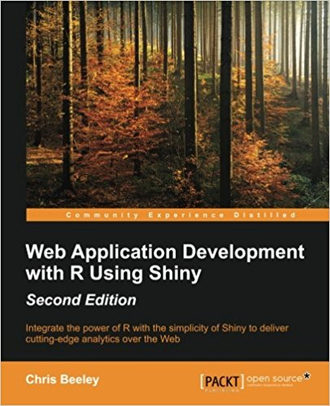

IN DEV

# The `shiny` package

The [package](http://shiny.rstudio.com/) provides a web framework for building web applications and turn analyses into interactive web applications.

We can develop Shiny applications in [RStudio](https://www.rstudio.com/products/shiny/) and deploy these applications online with Shiny Server, Shiny Server Pro or Shinyapps.io.

# Packages and htmlwidgets

The following packages and widgets are interactive:

- `ggvis` (similar to `ggplot2`) for charts and some maps.
- Highcharters for charts and maps.
- dygraphs for time series charts.
- rbokeh for charts and maps.
- Leaflet for maps.

Of course, other visualization packages work with Shiny.

# How-to

We can either make a package interactive (using `ggvis` function for example) or add more interactivity to an htmlwidget (`dygraphs` for example).

- The `dygraphs` [package](http://rstudio.github.io/dygraphs/shiny.html).
- The `plotly` [package](https://plot.ly/r/shiny-gallery/).
- The `rbokeh` package?
- The `highcharter` [package](http://jkunst.com/highcharter/shiny.html).
- The `datatables` [package](http://rstudio.github.io/DT/shiny.html).
- The `ggedit` package; [blog article 1]](https://www.r-bloggers.com/ggedit-0-1-1-shiny-module-to-interactvely-edit-ggplots-within-shiny-applications/) and [blog article 2](http://schmidscience.com/2016/11/16/ggedit-interactive-ggplot-aesthetic-and-theme-editor-r-statistics-blog/).

# Tutorials and books

We start with these [tutorials](http://shiny.rstudio.com/tutorial/), find other video tutorials online or books.

|     |     |     |
|:---:|:---:|:---:|
| { width=1.5in } | { width=1.5in } | { width=1.5in } |

# Cases (in dev)

To do:

- The Sugar Maple.
- Public Health.

---

This R Markdown document is made interactive using Shiny. Unlike the more traditional workflow of creating static reports, you can now create documents that allow your readers to change the assumptions underlying your analysis and see the results immediately. 

To learn more, see [Interactive Documents](http://rmarkdown.rstudio.com/authoring_shiny.html).

# Inputs and Outputs

You can embed Shiny inputs and outputs in your document. Outputs are automatically updated whenever inputs change.  This demonstrates how a standard R plot can be made interactive by wrapping it in the Shiny `renderPlot` function. The `selectInput` and `sliderInput` functions create the input widgets used to drive the plot.

```{r, include=FALSE}
setwd('/home/ugo/Documents/Rprojects/rmarkdown')
```

```{r eruptions, eval=FALSE}
library(shiny)

inputPanel(
  selectInput("n_breaks", label = "Number of bins:",
              choices = c(10, 20, 35, 50), selected = 20),
  
  sliderInput("bw_adjust", label = "Bandwidth adjustment:",
              min = 0.2, max = 2, value = 1, step = 0.2)
)

renderPlot({
  hist(faithful$eruptions, probability = TRUE, breaks = as.numeric(input$n_breaks),
       xlab = "Duration (minutes)", main = "Geyser eruption duration")
  
  dens <- density(faithful$eruptions, adjust = input$bw_adjust)
  lines(dens, col = "blue")
})
```

# Embedded Application

It's also possible to embed an entire Shiny application within an R Markdown document using the `shinyAppDir` function. This example embeds a Shiny application located in another directory:

```{r tabsets, eval=FALSE}
shinyAppDir(
  system.file("examples/06_tabsets", package = "shiny"),
  options = list(
    width = "100%", height = 550
  )
)
```

Note the use of the `height` parameter to determine how much vertical space the embedded application should occupy.

You can also use the `shinyApp` function to define an application inline rather than in an external directory.

In all of R code chunks above the `echo = FALSE` attribute is used. This is to prevent the R code within the chunk from rendering in the document alongside the Shiny components.

---