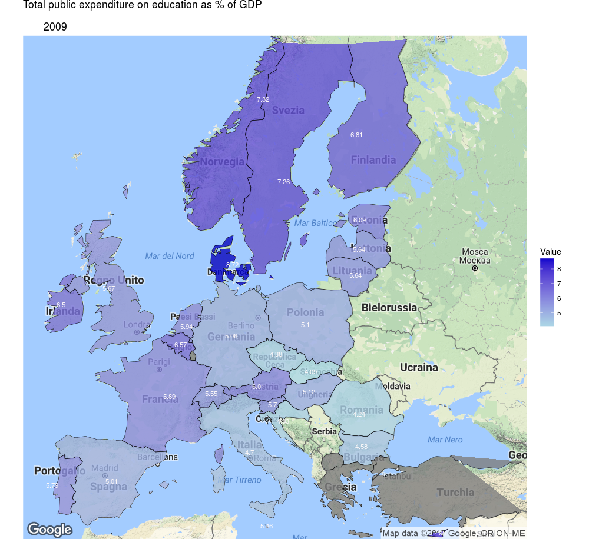
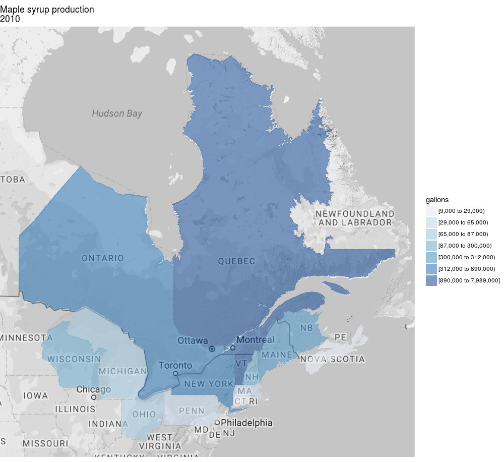
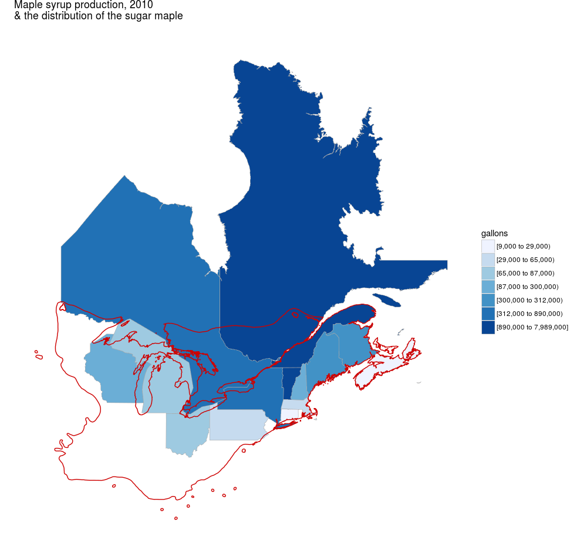
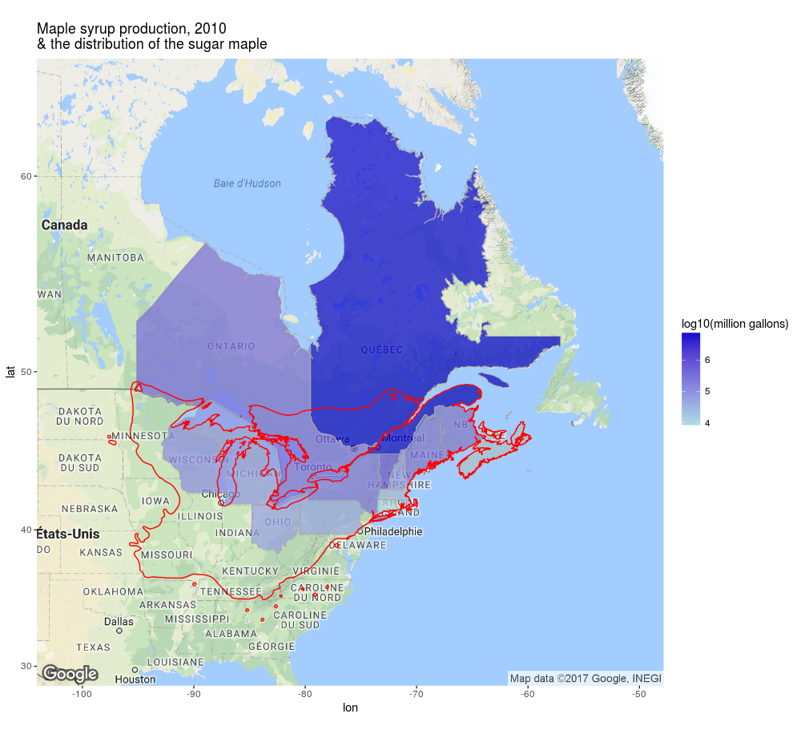

# European education

- Filling spatial vectors or polygons representing European countries with socio-economic data (making a choropleth map).
- Overlaying the polygons over a geographical map of Europe.
- Annotating the polygons with a numerical vector (using a joint or a merge).

Using the `ggplot2` package:

 

Using the `leaflet` package:

<embed seamless src="img/European_education.html" width=520px height=520px ></embed>

 

# Sugar maple

- Filling spatial vectors or polygons representing north-eastern Canadian provinces and US states with economic data (making a choropleth map).
- Overlaying the polygons over a geographical map of North-East America.
- Adding the distribution area of a tree species (other spacial vector data).
- Modifying the numeric scale (discrete, continuous, logarithmic).
- Annotating the polygons with a numerical vector (using a joint or a merge).

Using the `choroplethr` package:

Using the `choroplethr` & `ggplot2` packages:

Using the `ggplot2` package:

 

Using the `leaflet` package:

<embed seamless src="img/Sugar_maple.html" width=520px height=520px ></embed>

 

# Colonial Brazil

- Adding spatial vectors or polygons generated with Google Earth (converted into shapefiles with QGIS) to a geographical map.
- Adding markers and circles; these 'events' are hard-coded (in the code).

Using the `leaflet` package:

<embed seamless src="img/Colonial_brazil.html" width=520px height=520px ></embed>

 

# Joshua Tree

- Adding data points, markers and clustered markers to a geographical map; these 'events' come from a data frame (or a database).

Using the `leaflet` package:

<embed seamless src="img/Joshua_tree.html" width=520px height=520px ></embed>

 

---