# R Markdown templates

- R Notebook
- Document 
    - HTML
    - Markdown
    - PDF
    - Word
- Presentation
    - HTML (ioslides)
    - HTML (Slidy)
    - PDF (Beamer)
    - reveal.js
- Shiny
    - Document
    - Presentation (ioslides)
- Template
    - Lightweight and Pretty Document & Vignette[^v] (HTML)
    - GitHub Document (Markdown)
    - HTML clean & HTML clean ProjectTemplate report templates
    - HTML docco & HTML docco ProjectTemplate report templates
    - HTML readthedown & HTML readthedown ProjectTemplate report templates
    - Tufte Handout (HTML or PDF)
    - Journal Articles...
    
[^v]: A vignette is a long-form guide to a package.

Most of these templates are [showcased in a gallery](http://rmarkdown.rstudio.com/gallery.html).

Beyond the [basics settings](http://rmarkdown.rstudio.com/lesson-1.html) (code & plot chunks, code & languages, parameters, tables), we have [specific settings](http://rmarkdown.rstudio.com/lesson-9.html) and options for [HTML documents](http://rmarkdown.rstudio.com/html_document_format.html).

This [post](https://blog.rstudio.com/2016/03/21/r-markdown-custom-formats/) is a wrap-up of templates. It covers the `prettydoc` package, the `rmarkdown` package (GitHub), the `rmdformats` package (clear, docco, readthedocs), and the `tufte` package.

## R Notebook

This is similar to Jupyter Notebook.

## Documents

The document default settings...

```
output: document
```

...can be changed; see the [appearance and style](#appearance-and-style).

```
output:
  html_document:
    theme: default
    highlight: default
```

## Presentations

- `output: ioslides_presentation` creates simple HTML slides with smooth transitions in the browser.
- `output: slidy_presentation` creates contrasted HTML slides in the browser.
- `output: beamer_presentation` creates simple PDF slides.

## Shiny

The difference between a Document and a Shiny document...

```
output: html_document
runtime: shiny
```
... or a Presentation and a Shiny presentation...

```
output: ioslides_presentation
runtime: shiny
```

...is the interactivity.

---

## Templates

They have standard settings for theme and highlight.

### The [Lightweight and Pretty Document & Vignette](https://cran.r-project.org/web/packages/prettydoc/vignettes/architect.html) templates

Install the `prettydoc` package.

```
# Document
output:
  prettydoc::html_pretty:
    theme: architect
    highlight: github
```

```
# Vignette
output:
  prettydoc::html_pretty:
    theme: cayman
    highlight: github
```

### The GitHub Document & Vignette templates

Install the `rmarkdown` package.

```
# Document
output: github_document
```

```
# Vignette
output: rmarkdown::html_vignette
```

### The rmdformat templates

Install the `rmdformats` package.

```
output:
  rmdformats::readthedown:
    highlight: kate
```

...`rmdformats::html_clean:` and `rmdformats::html_docco:`.

### The Tufte templates

Install the `tufte` package.

```
output:
  tufte::tufte_handout: default
  ...
```

### The Journal Articles templates

Install the `rticles` package.

# [Appearance and style](https://bootswatch.com/)

|     |     |     |     |
|:---:|:---:|:---:|:---:|
| 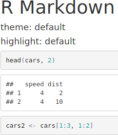 | 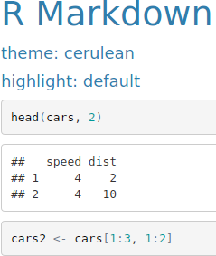 | 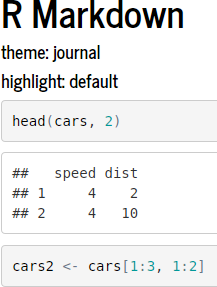 | 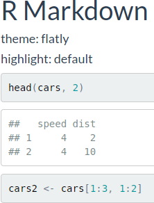 |
|     |     |     |     |
| 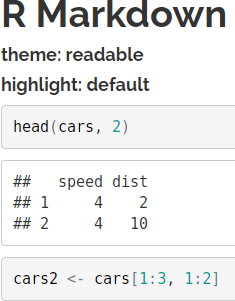 |  | 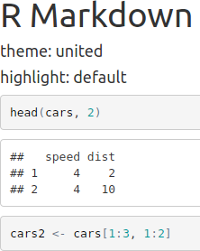 |  |
|     |     |     |     |
|  |  |  | 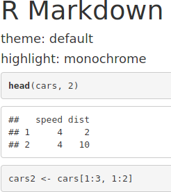 |
|     |     |     |     |
|  | 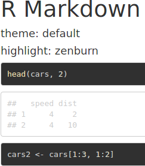 |  | 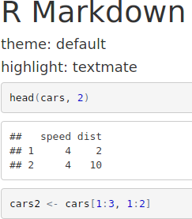 |
|     |     |     |     |
|  | 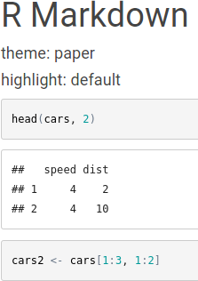 | 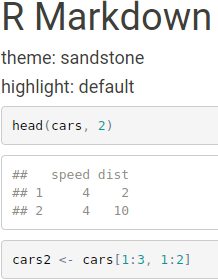 | 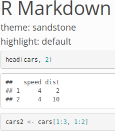 |
|     |     |     |     |
|  |   |   |   |

<br>

## Table of Contents

```
output:
  html_document:
    toc: true
    toc_depth: 2 # 2 shows levels # and ##
    toc_float: true # always visible on the left
      collapsed: false # sub-section are displayed
      smooth_scroll: true
      number_sections: true # add numbers
```

## Tabbed sections {.tabset .tabset-fade .tabset-pills}

Add {.tabset .tabset-fade .tabset-pills} following a `## Title`.

### By product

- (Content ABC)
- (Content DEF)
- (Content GHI)

### By region

- (Tab content XYZ)
- (Tab content 789)

## Figure options

```
output:
  html_document:
    fig_width: 7
    fig_height: 6
    fig_caption: true
```

# Data Frame printing

```{r}
# Markdown
knitr::kable(mtcars[1:3,])
```

```{r}
# HTML
library(tibble)

print(as_tibble(mtcars[1:3,]))
```

For long tables, set the heading...

```
output:
  html_document:
    df_print: paged
```

...and set the code chunk.

```
{r, cols.print=6, rows.print=3}
```

```{r, cols.print=6, rows.print=3}
mtcars
```

## Code folding

`code_folding: hide` displays the code with the Code button

```
output:
  html_document:
    code_folding: hide
```

`code_folding: show` displays the code with the Hide button

```{r, eval=TRUE, include=FALSE}
mtcars2 <- mtcars[1:5, 1:5]
```

`code_folding: hide`:
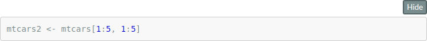
<br>

`code_folding: code`:


## Document dependencies

By default, R Markdown produces standalone HTML files with no external dependencies, using data: URIs to incorporate the contents of linked scripts, stylesheets, images, and videos. For dependencies on external files.

```
output:
  html_document:
    self_contained: false
```

For self-contained documents, MathJax is still loaded externally. We can serve MathJax locally: `mathjax: local` and `self_contained: false`.

## Keeping markdown

Creates a Markdown file with HTML. Or replace `html_document` with `md_document`. Consult the [documentation](http://rmarkdown.rstudio.com/markdown_document_format.html) for Markdown options.

```
output:
  html_document:
    keep_md: true
```

## Shared options

We can specify a set of default options to be shared by multiple documents within a directory. Include a file named `_output.yaml` within the directory:

```
html_document:
  self_contained: false
  theme: united
  highlight: textmate
...
```

All documents located in the same directory will inherit the yaml options. 

## [HTML fragments](http://rmarkdown.rstudio.com/html_fragment_format.html)

HTML fragments are not complete HTML documents. Rather, they are intended for inclusion within other web pages or content management systems (like blogs). As such, they don’t support features like embedded images, themes, or code highlighting (it’s expected that the environment they are ultimately published within handles these things).

```
title: "Optional"
output:
  html_fragment:
    number_sections: true
    smart: true
    keep_md: true
    fig_width: 7
    fig_height: 6
    fig_caption: true
    fig_retina: 2
    
```

---